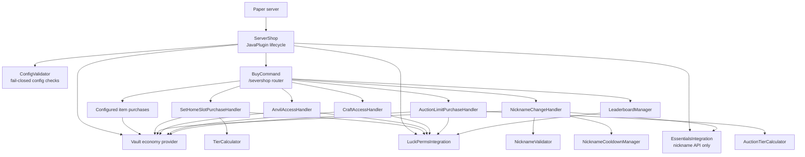
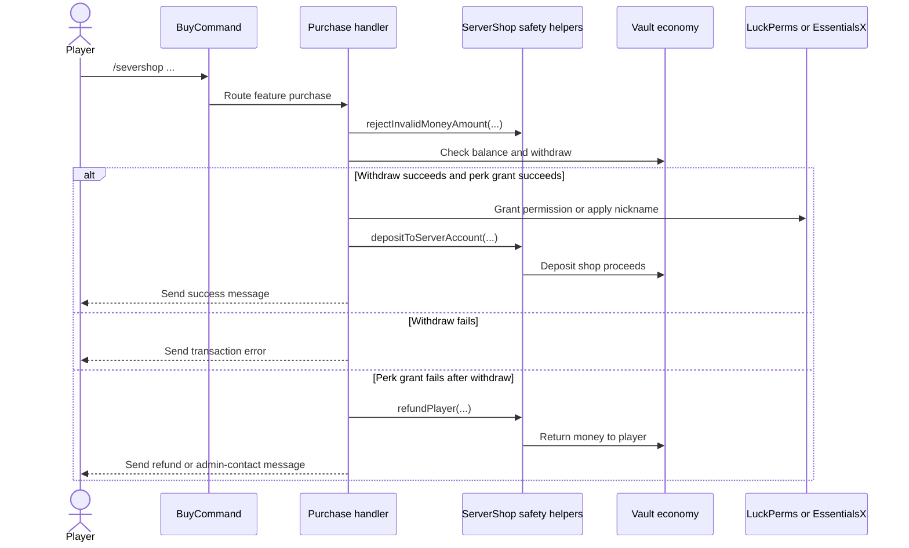
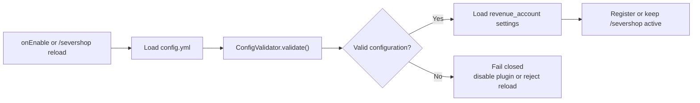

# ServerShop

ServerShop is a Paper plugin for economy-backed server purchases. It lets
players buy configured items and unlock permission-based perks through Vault,
LuckPerms, and optional EssentialsX integration.

## Features

- Item purchases through `/severshop <item> [amount]`.
- Buyable EssentialsX sethome tiers.
- Buyable nickname changes with cooldown and validation.
- Buyable anvil and crafting-table access permissions.
- Buyable PlayerAuctions-style auction limit tiers.
- Admin reload, info, and leaderboard commands.
- Configurable server revenue account for shop proceeds.

## Architecture

ServerShop is organized around a small plugin entry point, one command router,
and feature-specific purchase handlers. External server systems stay behind
integration classes so purchase logic can focus on validation, economy
transactions, permission grants, and rollback behavior.



## Runtime Flow

Every paid feature follows the same transaction shape: validate input, verify
the configured price, withdraw through Vault, apply the perk, and refund if the
downstream grant cannot be completed.



## Startup and Reload Safety

Configuration is validated at startup and after admin reloads. Invalid economy
prices or unsafe feature settings fail closed so the plugin does not continue
processing purchases with a broken configuration.



## Project Layout

```text
src/main/java/com/todlop/servershop/
  ServerShop.java                    Plugin lifecycle, Vault setup, refunds, revenue deposits
  ConfigValidator.java               Startup and reload configuration validation
  commands/BuyCommand.java           /severshop command routing and tab completion
  *PurchaseHandler.java              Feature-specific purchase workflows
  *Integration.java                   LuckPerms and EssentialsX API boundaries
  *TierCalculator.java                Permission tier calculation helpers
  Nickname*.java                      Nickname validation and cooldown rules
  LeaderboardManager.java            Permission-backed leaderboard queries
src/main/resources/
  config.yml                         Default prices, messages, permissions, and revenue account
  plugin.yml                         Paper command and dependency metadata
docs/
  COMMANDS.md                        Operator command and permission reference
```

## Safety Model

- Money values are validated during startup and reload, with integer-style
  configured prices expected by the public template.
- Runtime transaction helpers reject non-finite or negative money amounts before
  touching the economy provider.
- Vault transaction responses are checked for withdrawals, refunds, and revenue
  deposits.
- Permission and nickname features refund the player when the downstream grant
  fails after payment.
- EssentialsX integration uses the API directly for nickname changes instead of
  dispatching console commands.
- Build outputs, runtime data, and private server deployment notes are excluded
  from the public repository.

## Requirements

- Java 21
- Paper 1.21 compatible server
- Vault
- A Vault-compatible economy provider
- LuckPerms
- EssentialsX for nickname features only

## Build

```bash
mvn clean package
```

The compiled plugin artifact is written to Maven's output directory. Build
outputs are intentionally not tracked in git.

## Install

1. Build the project.
2. Copy the generated plugin artifact into your Paper server `plugins/`
   directory.
3. Install Vault, an economy provider, and LuckPerms.
4. Install EssentialsX if you want nickname purchases.
5. Start or restart the server.
6. Review and customize `plugins/ServerShop/config.yml`.

## Configuration

The default config includes Korean user-facing messages and example economy
prices. Operators should tune prices, permissions, and messages for their own
server economy.

The `revenue_account` section controls where shop proceeds go:

```yaml
revenue_account:
  enabled: true
  account: "server"
```

Set `enabled` to `false` if your economy does not use a server treasury account.

## Commands

See [docs/COMMANDS.md](docs/COMMANDS.md).

## Licensing

ServerShop is released under the MIT License. See [LICENSE](LICENSE).

Third-party APIs used by the plugin have their own licenses. See
[THIRD_PARTY_NOTICES.md](THIRD_PARTY_NOTICES.md).
